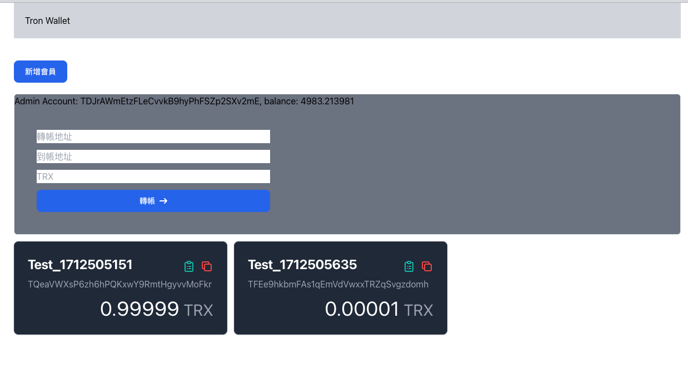
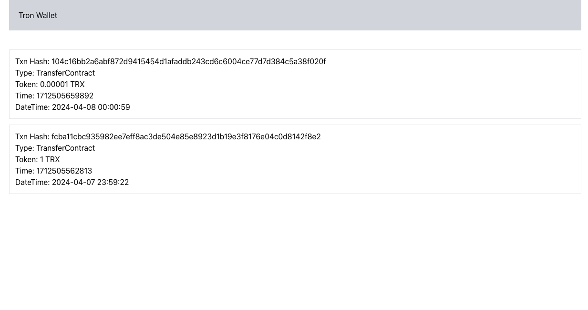
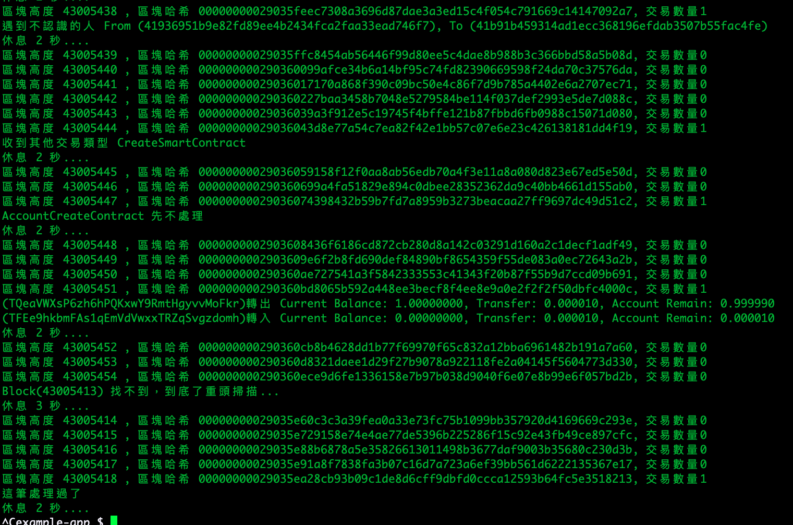
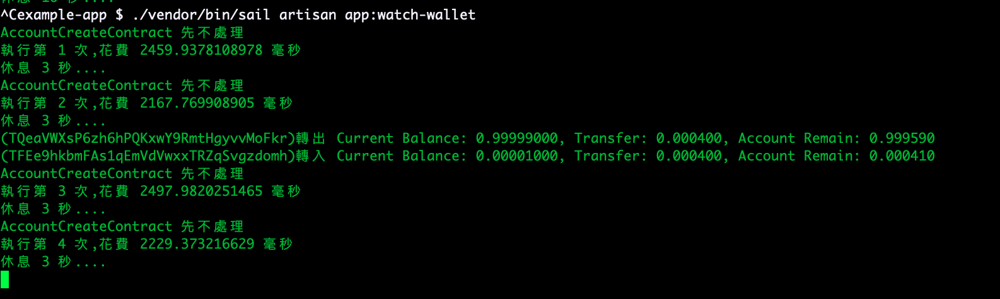

# 說明

簡易的Tron錢包，監控區塊鏈或地址轉入轉出行為並更新用戶錢包餘額

# 注意

- 只在Tron Shasta 測試鏈用過
- 只處理TRX交易，AccountCreateContract沒有處理 (感覺要處理因為有手續費問題?)
- 只是個interview的小project
- App\Services\TronService 寫死一個Activate Account用來激活其他帳號，你也可以拿來當轉帳的帳號  
激活帳號要手續費，如果餘額不夠應該會出錯
- 這個專案是已經經過artisan sail:publish的，所以你可以自己改docker配置或docker-compose.yaml 

# 使用Laravel Sail 建置環境

> php8.3 + mysql8.0  
> 額外安裝的Extension: php8.3-gmp  
> ./docker/8.3/Dockerfile 有額外安裝cron, 所以可以laravel schedule  
> 需要的話在`boostrap/app.php`處理排程業務

### 初始化
```bash
./init.sh
```
### sail up 啟動docker容器 `-d` 背景執行
```bash
./vendor/bin/sail up
```
### 開新terminal視窗，資料表migrate  
我使用 `php artisan schema:dump` 將schema轉到 `database/schema/mysql-schema.sql`  
migrations是沒有任何遷移記錄
```
./vendor/bin/sail artisan migrate
```
### 前端run起來 (我用的是node v20.11.1, npm 10.2.4) 建議使用nvm安裝
> 有裝Tailwind，所以你可以直接用
```
npm run dev
```
### Welcome Page

http://localhost  

  
  
# Artisan指令開始監控Tron區塊鏈交易地址

> 環境需要先ready，都是透過sail指令執行容器裡php
> (本地環境如果也是一樣的php版本應該也直接可以用) ?

- Command file `App\Console\Commands\WatchTronBlock`
- log file `sotrage/logs/watchblock.log`
```bash
./vendor/bin/sail artisan app:watch-block
```

- Command file `App\Console\Commands\WatchWallet`
- log file `sotrage/logs/watchwallet.log`
```bash
./vendor/bin/sail artisan app:watch-wallet
```


# Screenshot


---

---

---
